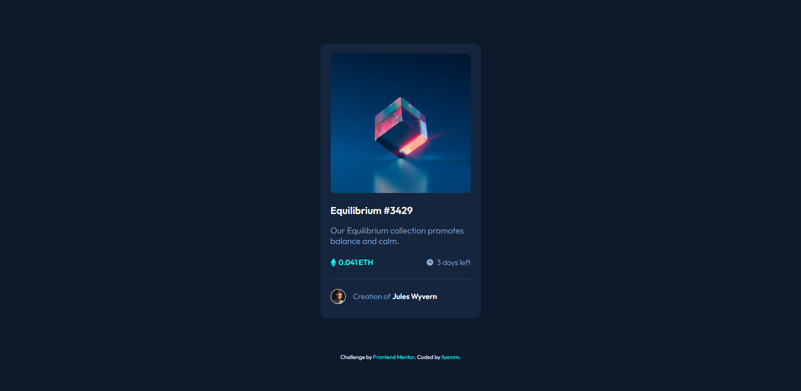

# Frontend Mentor - NFT preview card component solution

This is a solution to the [NFT preview card component challenge on Frontend Mentor](https://www.frontendmentor.io/challenges/nft-preview-card-component-SbdUL_w0U). Frontend Mentor challenges help you improve your coding skills by building realistic projects. 

## Table of contents

- [Overview](#overview)
  - [The challenge](#the-challenge)
  - [Screenshot](#screenshot)
  - [Links](#links)
- [My process](#my-process)
  - [Built with](#built-with)
  - [What I learned](#what-i-learned)
  - [Continued development](#continued-development)
  - [Useful resources](#useful-resources)
- [Author](#author)

## Overview

### The challenge

Users should be able to:

- View the optimal layout depending on their device's screen size
- See hover states for interactive elements

### Screenshot

### Links

- Solution URL: [Frontend Mentor Solution](https://www.frontendmentor.io/solutions/nft-preview-card-using-html5scss-VX-d56dgeT)
- Live Site URL: [Github Pages](https://ilyemm.github.io/nft-preview/)

## My process
I went with using SCSS instead to start practicing more modern CSS methods, and it was great. I loved being able to think about my CSS in a more hierarchical like HTML. Why didn't they have this initially? Better late than never I suppose. 

### Built with

- Semantic HTML5 markup
- CSS custom properties
- Flexbox
- SCSS/SASS

### What I learned

I learned about SCSS/SASS and some of its syntax! It was a great learning experience for me to learn the more modern way of setting CSS properties. I also learned about absolute positioning for child elements onto parent elements; that's actually what I had trouble for the longest time since I couldn't get the hover to work for only the image. 

### Continued development

I couldn't get the eye view image to keep it's 100% opacity when the hover action is initiated. That's what I'll be keeping an eye out for. 

### Useful resources

- [https://css-tricks.com/how-to-stack-elements-in-css/](https://css-tricks.com/how-to-stack-elements-in-css/) - This article was great in giving me a step-by-step visual on super-posing a child element on top of a parent element which ultimately helped me finish this design! 

## Author

- Frontend Mentor - [@ilyemm](https://www.frontendmentor.io/profile/ilyemm)

